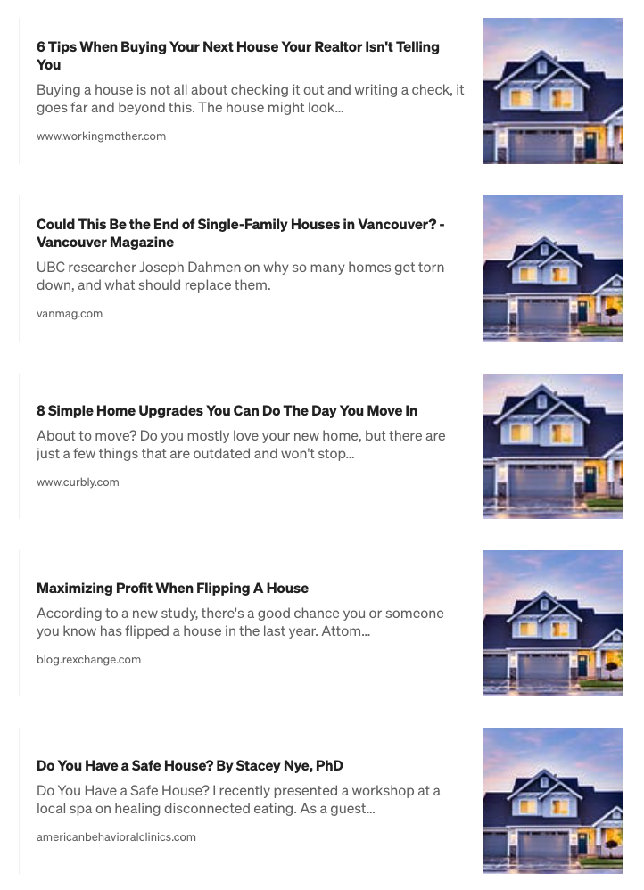

Over my career as a marketer and creative, I have heard a lot of arguments against using stock photos. Frankly, I (mostly) agree with them, sure — sure there is a time when you have to (maybe even should) use stock photos, especially when deadlines approach and that landing page just needs to get done. But In general, I usually land in the “don’t use stock photos” camp.

The main reason people give for the case against stock photos is that they will look too generalized, too cheesy, or sometimes even forced. We have all seen it, the young attractive woman smiling with pearly whites wearing a headset — that just screams extra sharp cheddar cheese. But there is another reason, that is often brought up, and uniquely different than photos being corny, and that is that sometimes everyone just uses the same stock photo. Just like the Amen Break, there are stock photos that begin to go down in infamy, but for all the wrong reasons. I don’t know if that is because they are just great photos or people are just that lazy, but if I had a dollar on it, I’d bet both.

Here is the culprit, but also, truly, a great photo
For this argument, I will use one specific example, a house that has become more famous than the Breaking Bad house with pizza on its roof; a house that I call Big Purple. This house has been used EVERYWHERE in real estate and related industries. This house, and photo, is admittedly, awesome, but for real — just let it be.

Here are some Examples of this photo being overused.

Ok ok, I think I got my point across, but seriously, take your shiny smartphones and a short drive and get your own photo — or even better, hire a photographer to take a library of photos, that you can use.

That being said, I don’t want to just hate on stock photos, you can get real lucky at places like Unsplash, Pexels, and OnePixel, all of which have some amazing options, albeit, sometimes over used.

