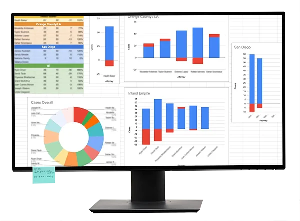

### Task: Create a dashboard for Attorney Caseload

- Phase 1: Collect needed data from internal systems
- Phase 2: Organize and load data into Google Sheets, create function to create needed table
- Phase 3: Create a dashboard to visualize the processed data

#### Situation:
It is imperative that marketing money is moved to specific geographic regions to give specific attorneys, at specific offices a full case load. or to stop the inflow of clients to overworked offices/attorneys. The issue is that cases open and close all times.

#### Hypothesis
Using available data (from law firm systems) along with Google Sheets, a dashboard could be automated to show caseload. This caseload could be pre-built and easy updated by copying and pasting data to a referenced sheet.

### Implementation
Data gathered from law firm software is uploaded into Sheets and with some savvy formulas, a dashboard was created.

### Results
Outcome
Now marketing can see weekly how many offices have full cases loads, or need extra cases.