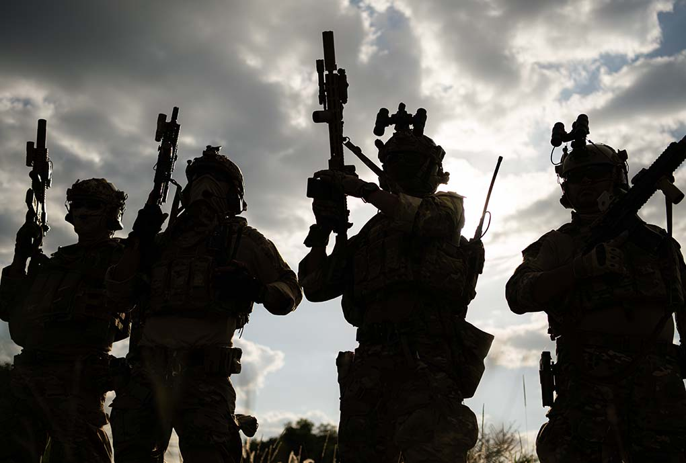

In the Infantry, we live and die by the doctrine laid out in FM 7-8: The Infantry Rifle Platoon and Squad. It teaches that combat power is not just a math equation of who has the most bullets. It is the sum of four distinct elements: Maneuver, Firepower, Protection, and Leadership.

Most marketing departments only focus on one: Firepower. They want more budget, more ads, more noise. But in combat, and in business, firepower without maneuver is just a waste of ammunition.

**Here is how I apply the FM 7-8 framework to build battle-tested marketing strategies.**

#### 1. Maneuver
Doctrine: *"Maneuver is the movement of forces supported by fire to achieve a position of advantage."*

In the Army, we rarely conduct a "Frontal Assault" (running directly at the machine guns). It’s suicide. Instead, we flank. We find the weak point. We move to where the enemy isn't.

**The Marketing Application:** Stop trying to out-spend your biggest competitor on their home turf. That is a frontal assault.

**The Flank:** If your competitor is dominating LinkedIn with massive ad spend, don't bid against them. Flank them by building a community on a different platform or by dominating long-tail SEO keywords they ignore.

**Agility:** Maneuver requires speed. If your website is a bloated WordPress instance that takes 6 weeks to update, you are stuck in the kill zone. This is why I use Astro. It allows us to pivot, deploy, and flank faster than the enterprise giants can schedule a meeting. If your ads strategy requires that 4 weeks of work before deployment, you are not agile, you are cruising in a battleship when you should be in a zodiac. 

#### 2. Firepower
Doctrine: *"Firepower facilitates maneuver by suppressing the enemy."*

Soldiers don't shoot to kill; they shoot to suppress. They keep the enemy's heads down so the maneuver element can move.

**The Marketing Application:** Firepower is your content volume and ad spend.

**Suppression:** You need enough consistent content (blogs, posts, emails) to keep your brand "top of mind" (suppressed).

**Massing Fires:** Don't trickle your budget. Mass your "fires" on a specific target (a specific demographic or problem) at a specific time. One coordinated campaign is more effective than 12 months of sporadic posting.

#### 3. Protection
Doctrine: *"Protection is the conservation of the fighting potential of a force."*

You cannot win if you are dead. Protection includes security, dispersion, and cover.

**The Marketing Application:** This is your defense against "churn" and "platform risk."

**Cover:** Do not build your entire business on "rented land" (Facebook/Google). That is fighting in the open. Your "Cover" is your owned data—your email list and your first-party analytics.

**Dispersion:** Don't put 100% of your budget in one channel. If that channel algorithm changes (artillery strike), your entire platoon is wiped out. Use the PACE Plan (Primary, Alternate, Contingency, Emergency) to ensure survival.

#### 4. Leadership
Doctrine: *"Leadership is the most essential element of combat power. It provides purpose, direction, and motivation."*

You can have the best rifles (tools) and the best position (maneuver), but without leadership, the squad freezes in the Fatal Funnel.

**The Marketing Application:** This is where the Fractional CMO enters the fight.

**Commander’s Intent:** Does your social media manager know why they are posting today? Or are they just checking a box? Leadership means defining the "Commander's Intent"—the end state we need to achieve—and trusting the team to execute.

**Decisiveness:** In marketing, hesitation is expensive. A decent plan executed violently now is better than a perfect plan executed next week.

#### The After Action Report
If your marketing feels expensive and ineffective, you are likely relying too much on Firepower and ignoring Maneuver. You are burning ammo shooting at a wall.

Stop the frontal assault. Find the flank. Protect your force. Lead from the front.