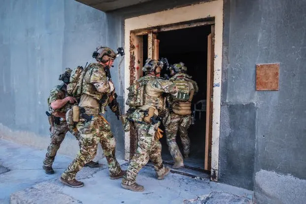
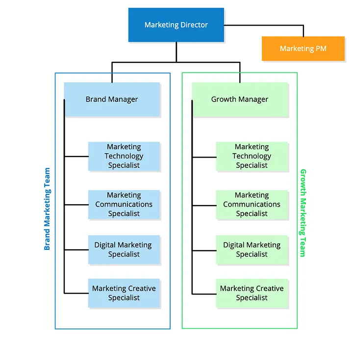
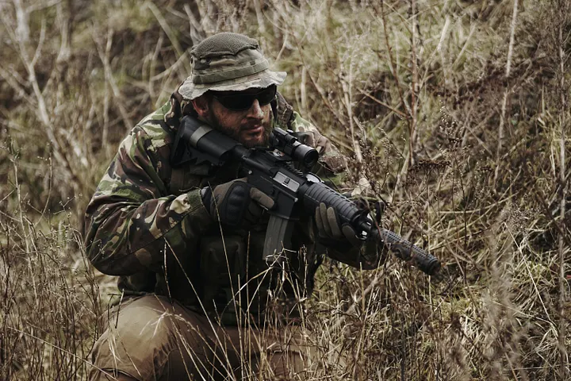

Applying the SF Operational Detachment-A (SFODA) composition to a Modern Marketing Team (Written in 2019 | Updated 2024)

I often find myself thinking about changes that can be made to marketing and business. Recently, I have been giving a lot of thought to building a top-tier marketing department specifically designed for successful startups and forward-thinking mid-sized companies. While researching this topic, I stumbled upon a blog about the perfect marketing team, and I have to say — I really liked its structure. This blog suggests a well-thought-out and effective team structure, although there are some minor changes I’d make to it, like how the CRO and A/B testing specialists are different roles, because let’s be real, sometimes you are lucky to have even one of them. Overall, I think this structure can work better for larger companies than the team I am proposing here. With that, I would also say that this marketing team, which as you can see by the title I am calling MKTSOCOM, would work for companies of any size, granted the budget is available.

The marketing structure in the 08 Agency article led me to think, what if it were possible to model a marketing team after (quite possibly) the best military team known to this big blue planet? I’m talking about the Special Forces (aka Green Berets) teams known as ODAs (Operations Detachment Alphas). An ODA consists of 12 members, a Commander, Assistant Commander, Operations Sergeant, Intelligence Sergeant, (2) Weapons Sergeants, (2) Medical Sergeants, (2) Engineering Sergeants, and (2) Communications Sergeants. One point to make here is that each sergeant is not only a master of their particular skill set, but they are competent in another lateral skill (if not multiple), so in other words, a weapon sergeant will be competent with commo and engineering/demo (the military loves redundancy, rightfully so). Clearly, marketing does not involve medical or weapons, but it does require intelligence and communication, right? Definitely), so how can we adapt and define this structure to the roles needed for marketing?

The way I see it, marketing has, at least in the modern era, a few overarching umbrella roles; directors/managers, marketing technologists, digital marketers, marketing communications, marketing creative, and a couple of other roles, most important of which is project management. Much like an ODA, there are two important facts to remember with this structure: everyone is treated like, and acts as a manager (sergeants in ODA teams), and everyone is a master of their skill set but also familiarized if not competent in other’s roles. So using the ODA structure, I propose a 12-man elite marketing team would be structured as follows: Marketing Director, Marketing Project Manager, Brand Manager, Growth Hacker Manager, (2) Marketing Technology Managers, (2) Marketing Communications Managers, (2) Digital Marketing Managers, and (2) Marketing Creative Managers.

Before looking at what the specific roles do, let’s dive into what they should all understand.

**Basic knowledge** - Everyone on the team should know marketing principles such as the marketing mix, the marketing utilities, and the marketing management concepts. The concepts of value and satisfaction. SWOT and marketing strategy planning. Marketing funnels and conversion strategies. Branding and brand management. Consumer psychology and behavioral economics. Basic stats, analytics, KPIs, and reporting. It should be noted that all marketers on these teams understand basic copywriting, art, and media as well. And lastly, familiarization with all marketing disciplines below. Overall, this basic knowledge should be akin to, or a little beyond, an MBA-level marketing management class.

With the basic knowledge defined, this is my proposition for specific marketing roles.

**Marketing Director** - The commander, the chief, they make it all happen. We all know what a marketing director does, long-term planning, organizing, and being the leader of the team.

**Brand Manager** - I propose this role is the second in command, and this is a pretty typical marketing role that fits in perfectly with this ODA-based marketing team. This role creates the brand strategy, acts as the brand guardian, maintains the integrity of the brand, and especially makes sure that the brand resonates with the audience. They also lead the communication plans, maintain budgets, and conduct competitor intelligence.

**Growth Manager** - This role is another position of leadership, somewhat like Bravo team leader, but with a focus on growth and acquisition. This role would also spearhead creating and researching the growth plan, leading disruptive and guerilla tactics, and also leading their respective breakout team, the growth hacking team.

**Marketing Project Manager** - this role is a project manager who is on the marketing team (shocking!). Ideally, they would be at least CAPM certified, understand six sigma, lean, and agile, really, insert any buzzwords that relate to project management and that’s it.

**Marketing Technology Specialist** - This is likely the fastest-growing role in the marketing department and has been championed most by Scott Brinker. This is a marketer who is in tune with the techy stuff (surprised!?) for example, analytics, CRO, chatbots, automation, MarTech, programming, databases even Technical SEO. In other words, these are marketers who think like IT, IS, developers, and data scientists, BUT remember, they are marketers first (in their role — I am not taking a stance about their education or previous experience).

**Marketing Communications Specialist** - This is the obvious one, these are marketers who are masters of ads, social media, content marketing, PR, email, direct response — shoot, the list goes on. In other words, this is the job people think about when they think about marketing. Specifically, these managers are masters of IMC.

**Digital Marketing Specialist** - This role will be the master of digital, from SEO to SMM, from PPC to email. They should also have a deep understanding of CRO and mobile. This role will also have a focus on CRMs, email delivery tools, and digital analytics.

**Marketing Creative Specialist** - Art directors, UI, front-end, video/audio production and editing, these members would be truly the masters of the creative space. Their technical skills should range from photography to wordsmithing, from Adobe Creative CC to HTML and CSS.

Furthermore, these roles are structured in two teams, a brand team and a growth team. Each team will have one of the two marketing roles on the team to fill out a 5-man team, including the team leaders. Content, inbound, and other strategies like ABM (along with the new proposed sales team, see below) should be equally spread across both teams. Another important point is that all marketing roles listed should have cross-training and redundancies, for example, Marketing Technology Manager and Digital Marketing Manager should all have access to, and an understanding of Google Analytics and Google Tag Manager, for example.

The structure of these teams, where they break out into the brand marketing and growth marketing team, can also be reorganized for ad hoc assignment, specifically both technologists and both digital marketers teaming up with the growth hacker to form a team called “The Technical Team”, and the two communications and creatives teaming up with the brand manager forming a team called “the Communication Team”. It doesn’t end there, these two teams would be well suited for other marketing functions like attending particular trade shows or conducting specialized “missions” that need more hands-on-deck, such as creating and filming a video series. Realistically, these 12 people can be arranged in any combination of ad hoc teams that fit a particular purpose.

Another added bonus I will throw in here is sales teams, which I believe should be structured like a crew-served weapons team (a crew-served weapons team is often also known as a machine gun team). I actually spent the early half of my military career as a gunner on a crew-served weapons team, specifically, a 240B team. A crew-served weapons team generally consists of a gunner, an assistant gunner (called an AG usually), and an ammo bearer. Now, like the above team, let's swap some roles around to develop the perfect sales teams which consists of a Salesperson, Associate salespersons/Inside sales (depending on the organization), and Sales enablement. To be honest, this team isn’t that far out of the box, but it would be effective, and fits nicely into our military-focused business teams.

To sum this all up, I am not proposing that every organization fire and reorganize their whole marketing department to reflect this MKTSOCOM team that I have proposed. I honestly think it would work best in a maturing startup that has heavy marketing needs and a decent budget for its marketing efforts.

Let me make one more point— marketing teams, strategies, and tactics are a lot like diets and exercise, meaning, keeping consistent and to the plan is more important than which specifically you pick. I have been a part of some well-organized marketing teams, some horribly organized marketing teams, and unfortunately, most often, one-man marketing teams (which usually end up giant messes from the top-down). To stress the point again, this team organization isn’t the end-all best marketing team, I would never propose that. But if you are fresh out the gate, have some healthy funding, or recently found big growth, and want to get aggressive with your efforts, then I believe this is a great structure; after all, it was plucked from the best military force in the world.