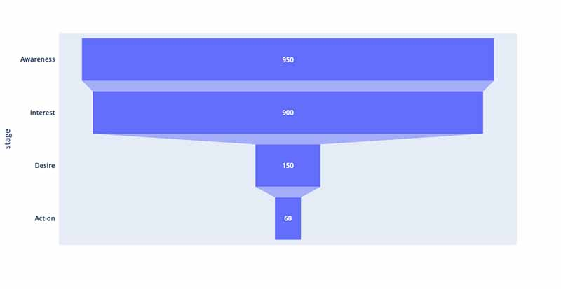

Throughout my time as an infatryman in the United States Army, espeically serving during the Global War on Terror, Close Quarters Battle, more commonly called “CQB” was drilled into us on a daily basis. The skills gained from CQB undeniably would be the thing that stands between a combat soldier's life and death. There is one specific piece of geometry that every soldier is trained to fear and respect: **The Fatal Funnel.**

Often, this is a doorway, a window, or a hallway. It is a choke point. It provides no coverage, not even concealment. It restricts your ability to maneuver. And it is exactly where the enemy’s attention is focused. Think about it it. You’re a fire team, stacked outside of a door waiting to breech and enter. You know you’re going through the door, the enemy knows you’re going through the door, and everyone knows there is going to be a fight. To borrow a climbing term, this is the crux, make it past the **Fatal Funnel** and things already start tolook a little better. 

The rule for the Fatal Funnel is simple: You never stop in the doorway.
If you hesitate, you die. To survive, you must move with "violence of action." You breach, you enter, and you clear the immediate threat. Speed is security.

### Your Customer Journey Has a Fatal Funnel

In marketing, the Fatal Funnel is the specific point in your user journey where you lose the majority of your traffic. It is the choke point where interest turns into hesitation, and hesitation turns into a failed conversion.

Most CMOs spend their budget decorating the "house." They obsess over brand colors, awareness campaigns, and top-of-funnel traffic. But they ignore the fact that their leads are getting slaughtered in the doorway.

As a Fractional CMO, I don’t start by painting the house. I start by clearing the fatal funnel.
Here is the Identify / Breach / Clear framework I use to fix broken conversion paths.

### 1. Identify (The Recon)

*“Where is the doorway?”*

In a building, the door is obvious. In a digital ecosystem, it’s hidden in the data. You cannot breach a room if you don’t know which wall the door is on.

**I look for the steepest drop-off in the analytics.**
- Is it the transition from the "Pricing" page to the "Checkout"?
- Is it the "Book a Demo" button?
- Is it a mobile load time lag?

We aren't looking for general trends; we are looking for the kill zone. Once we find the specific URL or form where 80% of people leave, we have identified the Fatal Funnel.

### 2. Breach (Violence of Action)

*“Remove the friction ruthlessly.”*

In the military, we don't knock politely. We breach. In marketing, "Violence of Action" means the aggressive removal of friction.
If users are hesitating in the funnel, it is because you put obstacles in their way. You are asking them to fill out a tax return when they just want to buy a t-shirt.

- **The Form:** If your checkout form has 7 fields, cut it to 3. If you ask for a phone number you never call, delete the field. Every extra field is a tripwire in the doorway.
- **The Speed:** Speed is security. If your website takes 4 seconds to load because of bloated code or plugins, your user is dead before they enter the room. This is why I build (mostly) on Astro. Static, lightweight, and instant. We don't want the user to have time to second-guess the click.
- **The Gate:** Do you have a "Request a Quote" button where a price tag should be? That is a barricaded door. Break it down. Show the price.

### 3. Clear (Point of Domination)

*“Get off the X.”*

Once you breach the door, you have to move to a "Point of Domination." You must secure the room.

In business, this is your immediate onboarding experience. Once a customer survives the Fatal Funnel (the purchase/signup), do not leave them standing in the foyer wondering what to do next.
- Redirect them immediately to a "Success" page.
- Trigger the welcome email instantly (via n8n or your automation tool of choice).
- Give them their first "win" within 5 minutes.

### The After Action Report

The market is crowded. Attention spans are short. If you force your customers to squeeze through a slow, complicated, or confusing process, they will retreat.

Stop decorating the exterior. Find your Fatal Funnel. Breach it with speed. Clear the way for your revenue.
Don’t stand in the door.
